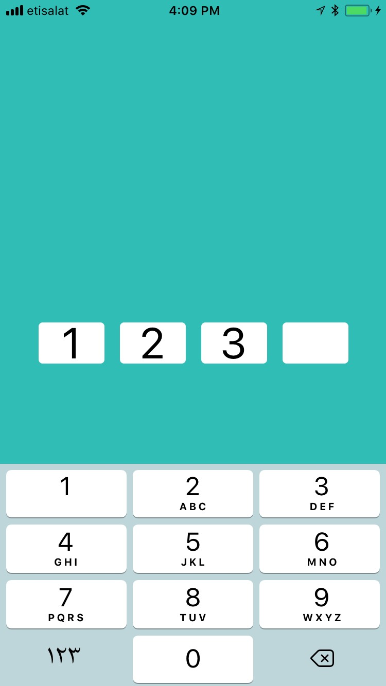
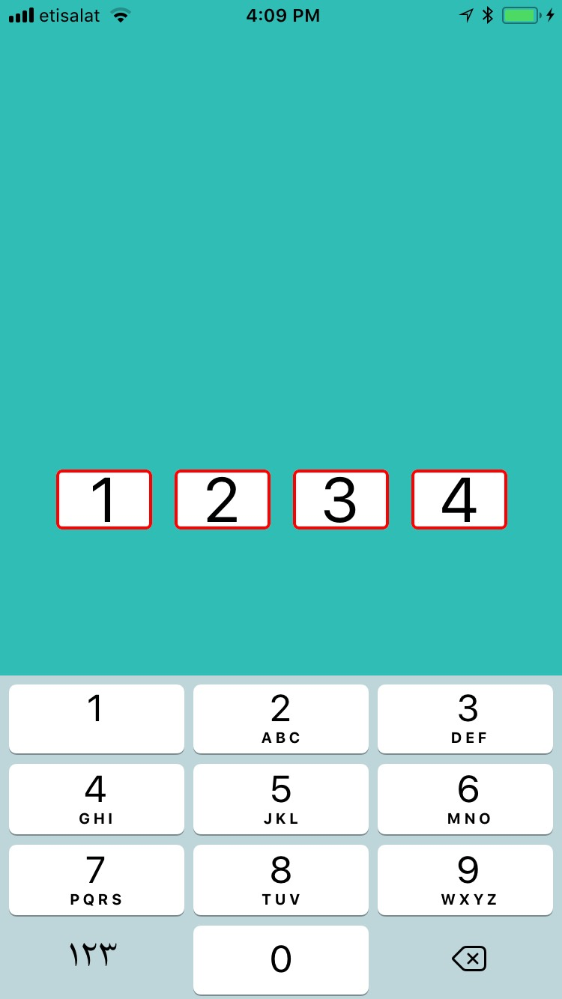

# UIVerificationCode
Design your UI Verification Code with flexible number of digits. 

# Install via cocoapods
```
pod ‘UIVerificationCode’, :git => ’https://github.com/Mustafa-Ezzat/UIVerificationCode'
```

# Usage
1- In Your Stroyboard drag UIView in your UIViewController

2- Outlet This UIView in Your UIViewController.swift
```
    @IBOutlet weak var verifyCodeView: UIView!
```

3- In your UIViewController.swift declare object from UIVerificationCode
```
    var verificationCode:UIVerificationCode!
```

4- In your UIViewController add this method for setup
   ```
    func setupCodeInput() {
        let frame = CGRect(x: 0, y: 0, width: verifyCodeView.frame.size.width, height: verifyCodeView.frame.size.height)
        verificationCode = UIVerificationCode(frame: frame)
        verificationCode.delegate = self
        verificationCode.errorColor = UIColor.red
        verificationCode.textColor = UIColor.black
        verificationCode.maxTag = 4
        verificationCode.codeWidth = 64
        verifyCodeView.addSubview(verificationCode)
        let tapGesture = UITapGestureRecognizer(target: self, action:  #selector (self.showKeyboardAction (_:)))
        verificationCode.addGestureRecognizer(tapGesture)
        verificationCode.setupCode()
    }
```
5- Then call it in viewDidLoad

6- Conform UIVerificationCodeDelegate
```
extension ViewController: UIVerificationCodeDelegate
{
    func verificationCode(_ verificationCode: UIVerificationCode, didFinishWithCode code: String) {
        //do somthing here for example show error
        verificationCode.showBorderColor()
    }
    
    func codeDeleteBackward() {
        //do somthing here for example hide error
        verificationCode.hideBorderColor()
    }
}
```
# Time to try let's go!

```
Input
```



```
If error occurs
```


